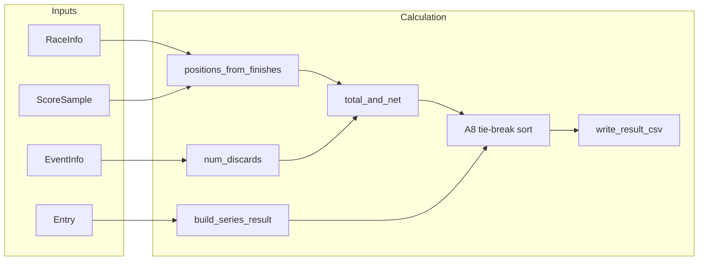

# Backend: Sailing Result Calculation

This document explains how `Calculation.py` produces sailing race series results and writes them to CSV. The module computes series scores using a discard rule, applies **RRS A8** tie-breaking, and outputs a CSV with RANK, Sail Number, race scores (R1, R2, …), TOTAL, and NET. Discarded scores are shown in parentheses, e.g. `(3.0)`.

---

## Data sources

Input is read from JSON files:

| File | Purpose |
|------|--------|
| **EventInfo.json** | Event `id` and `discard` array (see Discard rule below). |
| **Entry.json** | `event_id`, `sail_number` — which boats are entered. |
| **RaceInfo.json** | `event_id`, `race_id`, `start_time` — which races exist and their order. |
| **ScoreSample.json** (or other finish data) | `sail_number`, `race_id`, `finish_time` — raw finish order per race. |

- **Score** = finishing position: 1st = 1.0, 2nd = 2.0, etc. Positions are derived from finish times (earliest finish = 1st).

---

## How it works

### 1. Score matrix from finish data

**`positions_from_finishes(finishes, race_order)`**

- **Input**: List of finish records (`sail_number`, `race_id`, `finish_time`) and the list of race IDs in order.
- **Output**: A matrix `sail_number → { race_id → position }` (1-based). For each race, finishes are sorted by `finish_time` and assigned 1, 2, 3, …
- Boats that did not finish a race have no entry for that `race_id` (treated as no score / blank in the CSV).

### 2. Discard rule (EventInfo.discard)

**`num_discards(n_races, discard_thresholds)`**

- **Input**: Number of races in the series, and the event’s `discard` array (e.g. `[3, 6, 9]`).
- **Logic**: The array gives the **minimum number of races** needed for each discard:
  - 1st discard when races ≥ 1st element (e.g. 3),
  - 2nd discard when races ≥ 2nd element (e.g. 6),
  - and so on.
- **Examples**: With `[3, 6, 9]`: 2 races → 0 discards; 4 races → 1 discard; 7 races → 2 discards; 9 races → 3 discards.
- The number of discards is based on **how many races are in the series** (event-level), not per boat.

### 3. TOTAL and NET per boat

**`total_and_net(race_scores, num_discards)`**

- **Input**: One boat’s list of race scores (in race order; `None` for missing finish) and the number of discards allowed.
- **Logic**:
  - **TOTAL** = sum of all (non-`None`) race scores.
  - Discard the **worst** `num_discards` scores (higher = worse). If scores are tied, the **later** race (higher index) is discarded first.
  - **NET** = TOTAL − sum of the discarded scores.
- **Output**: `(total, net, is_discarded)` where `is_discarded[i]` is `True` if the score for race `i` is discarded.

### 4. A8 tie-breaking (RRS A8)

When two or more boats have the same NET score, ranking follows **Racing Rules of Sailing A8**:

- **A8.1**: List each boat’s race scores from **best to worst**, **excluding** discarded scores. At the first position where the lists differ, the boat with the **better (lower)** score ranks higher. Discarded scores are not used.
- **A8.2**: If still tied, compare by **last race** score, then **next-to-last**, and so on. **All** scores are used here (including discarded). Missing scores count as worst for this tie-break.

**`_a8_compare_key(race_scores, is_discarded)`** (internal) builds the sort key: (A8.1 tuple of non-discarded scores best-to-worst, A8.2 tuple last-race to first-race). Boats are sorted by NET, then by this key.

### 5. Ranking and CSV

**`build_series_result(event_id, entries, races, finishes, event_info)`**

- Builds the score matrix, applies the discard rule and TOTAL/NET for each boat, then sorts by (NET, A8 key).
- Assigns ranks 1, 2, 3, … with display strings "1st", "2nd", "3rd", "4th", …
- Returns a list of row dicts: `sail_number`, `rank`, `rank_display`, `scores` (list of `(score, is_discarded)` per race), `total`, `net`.

**`write_result_csv(rows, race_ids, path)`**

- Writes a CSV with header: **RANK, Sail Number, R1, R2, …, TOTAL, NET**.
- Each race column shows the score; if discarded, it is written in parentheses, e.g. `(3.0)`.
- Uses the standard `csv` module so commas in sail numbers are handled safely.

---

## Flow



---

## Main API

| Function | Purpose |
|----------|--------|
| **`generate_result_csv_for_event(event_id, event_info_path=..., entries_path=..., race_info_path=..., finishes_path=..., output_csv_path=...)`** | Loads all JSON files, computes the series result, writes the CSV to `output_csv_path`, and returns the list of result rows. Use this for a full run from files. |
| **`build_series_result(event_id, entries, races, finishes, event_info)`** | In-memory version: takes lists of dicts for entries, races, finishes, and one event dict. Returns the ranked result rows (no file I/O). |
| **`write_result_csv(rows, race_ids, path)`** | Writes the given result rows to a CSV file. |
| **`to_csv_string(rows, race_ids)`** | Returns the same CSV content as a string (useful for tests). |

Data loaders (for use with the above):

- `load_event_info(path)`, `load_entries(path)`, `load_race_info(path)`, `load_finishes(path)` — each returns a list of dicts from the corresponding JSON file.

---

## Example CSV output

```csv
RANK,Sail Number,R1,R2,R3,R4,TOTAL,NET
1st,1,1.0,2.0,(3.0),3.0,9.0,6.0
2nd,2,2.0,3.0,(4.0),2.0,11.0,7.0
```

---

## Assumptions and edge cases

- **Scores** are finishing positions (1.0, 2.0, …). DNF/DSQ are not modelled; they could be added later as high numbers or special values.
- **Missing finish**: A boat with no finish in a race has no score for that race (blank in CSV); that race is not included in TOTAL or NET. Discard count is based on the **event**’s number of races.
- **Ties**: Resolved by A8; ranks are assigned 1st, 2nd, 3rd, … after the sort (no “equal rank” in the CSV).

No extra dependencies: only Python stdlib (`json`, `csv`, `pathlib`).
